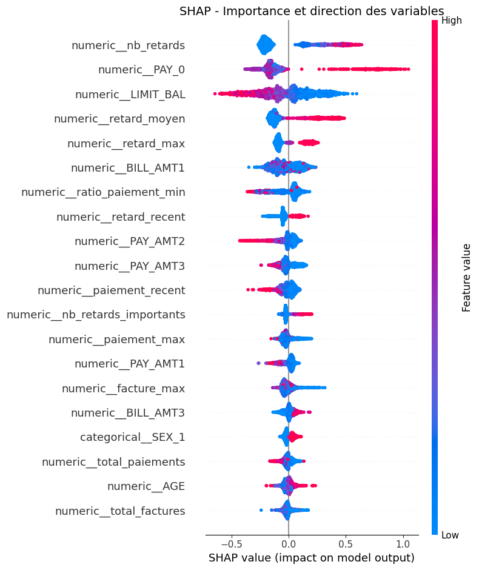

# 💳 Credit Risk Intelligence

### Explainable Credit Risk Prediction & Portfolio Analytics

Plateforme de Machine Learning dédiée à la prédiction, l'analyse et l'explicabilité du risque de défaut de crédit.

Le projet combine **Python, Scikit-learn, XGBoost, Feature Engineering, SHAP, Plotly et Streamlit** afin de transformer un modèle de classification en une application interactive d'analyse du risque.

---

# 1. 🎯  · DONNÉES & PROJET

### 📚 Source des données & préparation

Les données proviennent du dataset **Default of Credit Card Clients**, publié par l’**UCI Machine Learning Repository**. Le jeu contient 30 000 observations et porte sur le risque de défaut de paiement de clients de cartes de crédit. :contentReference[oaicite:0]{index=0}

Les données sont préparées à travers un pipeline reproductible intégrant le **feature engineering**, le preprocessing et la transformation des variables avant leur utilisation par les modèles de Machine Learning.

**Source officielle :** [UCI Machine Learning Repository — Default of Credit Card Clients](https://archive.ics.uci.edu/dataset/350/default)

L'objectif de **Credit Risk Intelligence** est d'estimer la probabilité de défaut d'un client à partir de ses caractéristiques financières et comportementales, tout en fournissant une interprétation des prédictions.

La plateforme permet :

- 👤 Analyse individuelle d'un client
- 🔮 Simulation de profils
- 🧠 Explication des prédictions avec SHAP
- 📊 Analyse de portefeuille
- 📈 Monitoring du risque
- 💾 Export des résultats

### Données

Le modèle est entraîné sur le dataset **Default of Credit Card Clients** provenant de l'**UCI Machine Learning Repository**.

30 000 observations
45 variables au total
44 variables explicatives
1 variable cible : default payment next month

Classe 0 : 23 364
Classe 1 :  6 636

Taux de défaut : 22,12 %

## 🚀 Fonctionnalités principales

### 👤 Analyse client

Évaluation individuelle du profil d'un client et estimation de sa probabilité de défaut.

L'application fournit notamment :

- la probabilité de défaut ;
- le niveau de risque ;
- la décision associée au seuil du modèle.

### 🔮 Simulation

Modification des caractéristiques d'un profil client afin d'observer l'évolution de sa probabilité de défaut.

### 🧠 Explainable AI

Interprétation des prédictions individuelles avec **SHAP (SHapley Additive exPlanations)**.

La plateforme identifie notamment :

- les facteurs contribuant à augmenter le risque ;
- les facteurs contribuant à réduire le risque ;
- les contributions des variables à la prédiction.

### 📊 Analyse de portefeuille

Chargement d'un portefeuille CSV et application du modèle à plusieurs clients.

### 📈 Monitoring

Visualisation de la distribution du risque sur le portefeuille analysé.

### 💾 Export

Export des résultats de l'analyse de portefeuille au format CSV.

# 🟩 BLOC 2 — Machine Learning & résultats

---

## 🤖 2. Modélisation & résultats

### Comparaison des modèles

Trois modèles ont été entraînés et comparés sur les **6 000 observations du jeu de test**.

| Modèle | Accuracy | Precision | Recall | F1 | ROC-AUC | PR-AUC |
|---|---:|---:|---:|---:|---:|---:|
| Logistic Regression | 0.8192 | 0.6681 | 0.3625 | 0.4700 | 0.7609 | 0.5320 |
| Random Forest | 0.8113 | 0.6030 | 0.4303 | 0.5022 | 0.7662 | 0.5443 |
| **XGBoost** | 0.7628 | 0.4723 | **0.6157** | **0.5345** | **0.7756** | **0.5560** |

**XGBoost a été retenu comme modèle final** grâce à son meilleur Recall, F1-Score, ROC-AUC et PR-AUC sur la classe défaut.

### Optimisation des hyperparamètres

Une recherche d'hyperparamètres avec validation croisée a ensuite été réalisée avec le **PR-AUC** comme métrique de sélection.

**Meilleur PR-AUC CV : 0.5604**

| Hyperparamètre | Valeur |
|---|---:|
| `n_estimators` | 300 |
| `learning_rate` | 0.02 |
| `max_depth` | 6 |
| `min_child_weight` | 3 |
| `subsample` | 0.8 |
| `colsample_bytree` | 0.7 |
| `gamma` | 0.5 |

### XGBoost optimisé

| Métrique | Résultat |
|---|---:|
| Accuracy | **0.7658** |
| Precision | **0.4772** |
| Recall | **0.6142** |
| F1-Score | **0.5371** |
| ROC-AUC | **0.7796** |
| PR-AUC | **0.5587** |

### Optimisation du seuil

Plusieurs seuils ont été testés entre 20 % et 70 %.

Le meilleur F1-score obtenu est :

Threshold : 0.6000
Precision : 0.5423
Recall    : 0.5313
F1-Score  : 0.5367
---

## 🧠 Explainable AI — SHAP

L'interprétabilité constitue une composante centrale de **Credit Risk Intelligence**.

Le projet utilise **SHAP** afin d'expliquer les prédictions individuelles produites par le modèle XGBoost.

Pour chaque client analysé, le système calcule les contributions des différentes variables à la prédiction.

### Facteurs aggravants

Les variables présentant une contribution SHAP positive augmentent la sortie du modèle vers le risque de défaut.

### Facteurs protecteurs

Les variables présentant une contribution SHAP négative diminuent la sortie du modèle vers le risque de défaut.

### Exemple

Pour un profil de test, les principaux facteurs protecteurs identifiés par le modèle comprennent notamment :

- **Ratio de paiement minimum**
- **Nombre de retards**
- **Retard le plus récent**
- **Retard moyen**
- **Facture récente**

Les contributions SHAP permettent ainsi de passer d'une simple prédiction à une **explication de la décision du modèle**.

---

## 🔍 Exemple de sortie SHAP

Le système produit notamment :

Nombre de features SHAP : 48

Ratio de paiement minimum    → contribution négative
Nombre de retards            → contribution négative
Retard le plus récent        → contribution négative
Retard moyen                 → contribution négative
Facture récente              → contribution négative

Le module SHAP permet ainsi de passer d'une simple probabilité de défaut à une
**explication des facteurs ayant contribué à la prédiction**.

---

## 🏗️ Architecture du projet

L'application suit une architecture séparant la logique métier, le modèle de Machine Learning et l'interface utilisateur.

                         Données client / CSV
                                  │
                                  ▼
                         Feature Engineering
                                  │
                                  ▼
                            Preprocessing
                                  │
                                  ▼
                            XGBoost Model
                                  │
                     ┌────────────┴────────────┐
                     │                         │
                     ▼                         ▼
              Probabilité                  SHAP
                     │                         │
                     ▼                         ▼
             Niveau de risque           Explication
                     │
                     ▼
                  Streamlit
                     │
        ┌────────────┼────────────┐
        ▼            ▼            ▼
     Analyse      Simulation   Portefeuille
        │            │            │
        └────────────┼────────────┘
                     ▼
                 Monitoring

                 ---

# 3.  ENGINEERING · APPLICATION · VALIDATION

L'application sépare le traitement des données, la prédiction, l'explicabilité et l'interface utilisateur.

### Architecture

Données client / CSV
        ↓
Feature Engineering
        ↓
Preprocessing
        ↓
XGBoost optimisé
        ↓
Probabilité de défaut
        ├──→ Niveau de risque
        └──→ SHAP / Explication
                    ↓
                Streamlit
                    ↓
      Analyse · Simulation · Portefeuille
                    ↓
                Monitoring

## 🔭 Perspectives d'amélioration

Plusieurs évolutions pourraient être ajoutées au projet :

### Machine Learning

- comparaison avec d'autres algorithmes ;
- optimisation avancée des hyperparamètres ;
- calibration des probabilités ;
- analyse plus approfondie du compromis précision / rappel ;
- validation croisée renforcée.

### Explainable AI

- visualisations SHAP globales ;
- analyse de l'importance des variables ;
- comparaison des explications entre différents profils ;
- génération automatique de rapports d'explication.

### MLOps

- suivi des versions du modèle ;
- automatisation du pipeline d'entraînement ;
- monitoring de la dérive des données ;
- suivi des performances en production ;
- pipeline CI/CD ;
- tests automatisés.

### Application

- authentification des utilisateurs ;
- gestion de plusieurs portefeuilles ;
- historique des analyses ;
- tableaux de bord plus avancés ;
- déploiement cloud ;
- API de scoring.

---

## 🧪 Validation technique

Le projet comprend également des scripts dédiés à la validation des fonctionnalités principales :

src/test_prediction.py
src/test_shap.py
